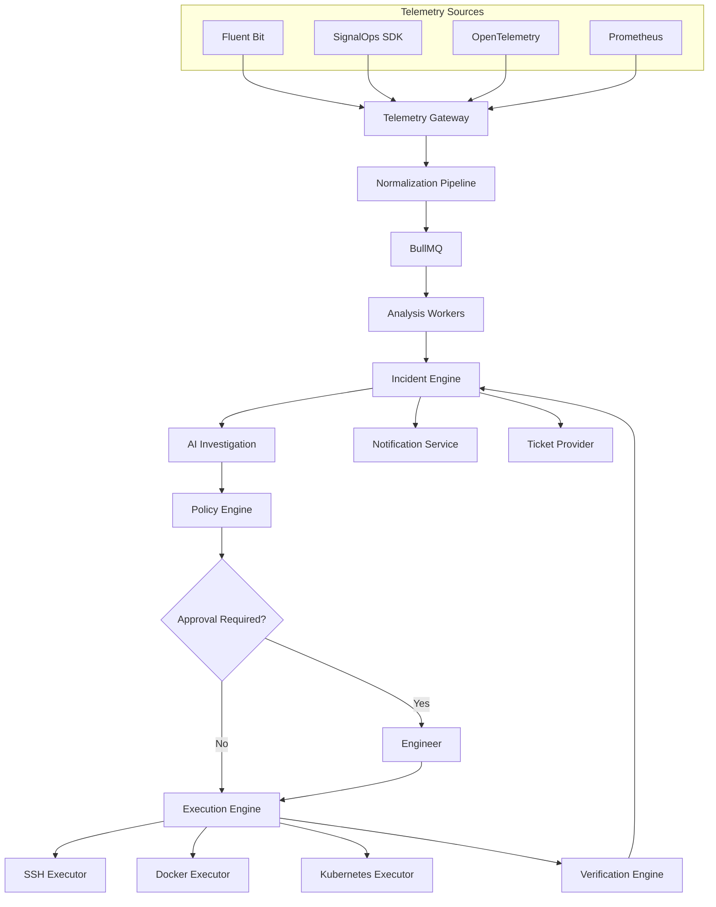

# Architecture Overview

> **Document Version:** 1.0
>
> **Status:** Draft (Version 1)
>
> This document describes the high-level architecture of SignalOps, its major components, data flow, architectural decisions, and the long-term evolution of the platform.

---

# Table of Contents

- Introduction
- Architecture Goals
- High-Level System Architecture
- Core Building Blocks
- System Workflow
- Component Responsibilities
- Data Flow
- Version 1 Architecture
- Future Architecture
- Technology Stack
- Architectural Decisions
- Design Principles
- Scalability Strategy
- Security Architecture
- Deployment Architecture
- Future Evolution

---

# Introduction

SignalOps is an **AI-native Incident Response Platform** designed to reduce operational overhead by transforming infrastructure telemetry into actionable incidents and assisting engineers through AI-powered investigations and secure automation.

Unlike traditional monitoring solutions, SignalOps does not stop after generating alerts. Instead, it guides the entire incident lifecycle:

```
Telemetry

↓

Detection

↓

Incident

↓

Investigation

↓

Resolution Plan

↓

Approval

↓

Execution

↓

Verification

↓

Resolved
```

The architecture has been intentionally designed around **Domain-Driven Design**, **Clean Architecture**, and **Event-Driven Architecture** to ensure long-term maintainability and extensibility.

---

# Architecture Goals

The architecture aims to satisfy the following goals.

## Functional Goals

- Collect telemetry from multiple providers
- Detect anomalies
- Manage incident lifecycle
- Generate AI investigations
- Execute approved remediation
- Notify users
- Integrate with external systems

---

## Technical Goals

- Modular
- Loosely coupled
- Easily extensible
- Infrastructure agnostic
- Secure by default
- Event-driven
- Production-inspired

---

## Long-Term Goals

Support

- Kubernetes
- Docker
- Cloud Infrastructure
- OpenTelemetry
- Prometheus
- SignalOps Agent
- Multiple AI Providers
- Multiple Ticket Providers

without redesigning the core application.

---

# High-Level System Architecture



---

# Core Building Blocks

The platform is divided into several logical domains.

```
SignalOps

├── Identity
├── Infrastructure
├── Telemetry
├── Incident
├── AI
├── Automation
└── Integrations
```

Each domain owns its own business logic and communicates through events.

---

# Identity Domain

Responsible for

- Users
- Organizations
- Projects
- Authentication
- Authorization
- API Keys

This domain has no knowledge of telemetry or incidents.

---

# Infrastructure Domain

Responsible for

- Servers
- Docker Hosts
- Kubernetes Clusters
- SSH Credentials
- Environment Metadata
- Agent Configuration

This domain represents monitored infrastructure.

---

# Telemetry Domain

Responsible for

- Telemetry Providers
- Signal Normalization
- Queue Publishing
- Telemetry Validation

The Telemetry domain never performs anomaly detection.

Its responsibility ends after publishing normalized signals.

---

# Incident Domain

Responsible for

- Detection
- Incidents
- Severity
- Timeline
- Status
- Resolution History

This is the heart of the application.

---

# AI Domain

Responsible for

- Context Collection
- Prompt Construction
- Root Cause Analysis
- Resolution Planning

The AI domain **never executes infrastructure operations directly**.

---

# Automation Domain

Responsible for

- Policy Engine
- Approval Workflow
- Execution Engine
- Verification
- Audit Logs

Automation always operates through predefined tools.

---

# Integration Domain

Responsible for

Telemetry Providers

- Fluent Bit
- SignalOps SDK
- OpenTelemetry

Notification Providers

- Email
- Slack
- Discord

Ticket Providers

- Jira
- ServiceNow
- Native Incidents

Execution Providers

- SSH
- Docker
- Kubernetes

Every provider implements a common interface.

---

# Complete Incident Workflow

The following sequence illustrates the complete lifecycle of an incident.

```text
Server

↓

Generates Logs

↓

Fluent Bit

↓

Telemetry Gateway

↓

Normalize Signal

↓

BullMQ Queue

↓

Analysis Worker

↓

Rule Engine

↓

Anomaly Found

↓

Incident Created

↓

Slack + Email

↓

AI Investigation

↓

Resolution Plan

↓

Policy Validation

↓

Human Approval (optional)

↓

SSH Execution

↓

Verification

↓

Incident Closed
```

---

# Request Lifecycle

## Step 1

Infrastructure generates telemetry.

Example

```
Nginx Error Log

↓

Fluent Bit
```

---

## Step 2

Telemetry Gateway receives data.

Responsibilities

- Authentication
- Validation
- Parsing
- Normalization

Produces

```
Signal
```

---

## Step 3

Signal is published to BullMQ.

The ingestion API returns immediately.

Heavy analysis never blocks incoming requests.

---

## Step 4

Analysis Workers consume telemetry.

Responsibilities

- Rule Matching
- Pattern Detection
- Threshold Evaluation

Future

- Machine Learning
- Correlation
- AI Detection

---

## Step 5

An Incident is created.

The Incident Engine

- assigns severity
- creates timeline
- emits events

Example

```
IncidentCreated
```

---

## Step 6

Subscribers react.

Examples

Notification Service

```
IncidentCreated

↓

Slack
```

AI Service

```
IncidentCreated

↓

Investigation
```

Ticket Service

```
IncidentCreated

↓

Jira
```

---

## Step 7

AI investigates.

The AI receives

- Recent logs
- Server metadata
- Historical incidents
- Policies

Returns

- Summary
- Root Cause
- Confidence
- Resolution Plan

---

## Step 8

Policy Engine validates.

Questions

- Is execution enabled?
- Production server?
- Requires approval?
- Tool allowed?
- Maintenance window?

---

## Step 9

Execution Engine performs approved actions.

Example

```
Restart Nginx
```

instead of

```
sudo systemctl restart nginx
```

The AI never generates shell commands.

Instead it generates structured tool calls.

Example

```json
{
  "tool": "restart_service",
  "service": "nginx"
}
```

---

## Step 10

Verification Engine validates recovery.

Checks

- Process Running
- Errors Gone
- Logs Stable

If verification succeeds

```
Incident

↓

Resolved
```

Otherwise

```
Escalated
```

---

# Version 1 Architecture

Version 1 intentionally focuses on a narrow but complete implementation.

Supported

✅ Linux Servers

✅ Docker Hosts

✅ Fluent Bit

✅ PostgreSQL

✅ Redis

✅ BullMQ

✅ AI Investigation

✅ SSH Automation

---

Excluded

❌ Kubernetes

❌ OpenTelemetry

❌ Prometheus

❌ SignalOps SDK

❌ ClickHouse Clustering

❌ Multi-Agent AI

❌ Correlation Engine

---

# Future Architecture

Future versions expand horizontally.

```
Telemetry

├── Logs

├── Metrics

├── Traces

├── Events

↓

Correlation Engine

↓

AI SRE

↓

Knowledge Base

↓

Learning Engine
```

The core architecture remains unchanged.

Only providers and processing pipelines expand.

---

# Technology Stack

| Layer          | Technology               |
| -------------- | ------------------------ |
| Language       | TypeScript               |
| Framework      | NestJS                   |
| ORM            | typeorm                  |
| Database       | PostgreSQL               |
| Log Storage    | ClickHouse               |
| Queue          | BullMQ                   |
| Cache          | Redis                    |
| AI             | OpenAI Compatible Models |
| Containers     | Docker                   |
| Testing        | Vitest                   |
| Authentication | JWT                      |
| Frontend       | Next.js                  |

---

# Architectural Decisions

## PostgreSQL

Chosen for

- Reliability
- Strong relational modeling
- Excellent typeorm support

---

## Redis

Chosen for

- BullMQ
- Caching
- Distributed Locks

---

## BullMQ

Chosen because

- Simple
- Reliable
- Excellent NestJS ecosystem
- Easy migration path to Kafka

---

## ClickHouse

Chosen because

- Designed for log analytics
- High compression
- Fast aggregation queries

Raw telemetry does not belong in PostgreSQL.

---

# Design Principles

Every component follows these principles.

## Domain First

Business domains own business logic.

Infrastructure only supports domains.

---

## Event Driven

Business actions emit events.

Consumers react independently.

No tight coupling.

---

## Infrastructure Agnostic

The application should never know whether telemetry came from

- Fluent Bit
- SignalOps SDK
- Prometheus

Everything becomes

```
Signal
```

---

## AI Assisted

AI suggests.

Policies decide.

Executors execute.

Humans approve when necessary.

---

## Plugin Architecture

Every external dependency is replaceable.

Examples

```
NotificationProvider

↓

Slack

↓

Email

↓

Discord
```

---

# Scalability Strategy

SignalOps scales horizontally.

```
Gateway

↓

BullMQ

↓

Multiple Workers

↓

Shared PostgreSQL

↓

Shared Redis
```

Workers can be added independently without changing business logic.

---

# Security Architecture

Security is enforced through multiple layers.

- JWT Authentication
- Role-Based Access Control
- API Keys
- Encrypted Credentials
- Policy Validation
- Approval Workflow
- Audit Logs

Every infrastructure action is recorded.

---

# Deployment Architecture

Version 1 deployment

```text
Docker Compose

├── API

├── Worker

├── PostgreSQL

├── Redis

├── ClickHouse

└── Frontend
```

Future

```
Kubernetes

↓

Horizontal Autoscaling

↓

Managed Databases

↓

Cloud Object Storage
```

---

# Future Evolution

The architecture intentionally separates business domains from infrastructure.

This enables future support for

- Metrics
- Distributed Tracing
- Kubernetes
- SignalOps Agent
- AI Knowledge Base
- Multi-Agent Systems
- Cloud Providers
- Additional Notification Channels

without requiring major architectural changes.

---

# Summary

SignalOps follows a modular, event-driven architecture designed for long-term evolution.

Version 1 deliberately implements a focused subset of this architecture while preserving clear extension points for future capabilities. By separating telemetry ingestion, incident management, AI reasoning, automation, and integrations into independent domains, the platform remains maintainable, testable, and scalable as new providers and features are introduced.
