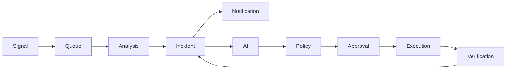

# Event Flow

> **Document Version:** 1.0  
> **Status:** Draft (Version 1)

This document defines the event-driven architecture of SignalOps, including commands, domain events, integration events, queue topology, worker responsibilities, retry strategy, and the complete lifecycle of an incident.

---

# Table of Contents

- Why Event-Driven Architecture?
- Event Categories
- Event Naming Convention
- Event Flow Overview
- Queue Topology
- Event Bus
- Complete Workflows
- Worker Responsibilities
- Retry Strategy
- Dead Letter Queue
- Event Contracts
- Event Versioning
- V1 Event Catalog
- Future Evolution

---

# Why Event-Driven Architecture?

SignalOps is fundamentally an **event processing platform**.

Instead of tightly coupling modules through direct service calls:

```
Telemetry Service

↓

Incident Service

↓

Notification Service

↓

AI Service
```

SignalOps communicates using business events.

```
Signal Received

↓

Signal Normalized

↓

Incident Created

↓

Notification Sent

↓

Investigation Started

↓

Execution Started
```

Benefits:

- Loose coupling
- Horizontal scalability
- Independent workers
- Easier testing
- Better observability
- Easier future migration to Kafka or NATS

---

# Event Categories

SignalOps uses three different kinds of events.

---

## 1. Commands

Commands represent **intent**.

Someone or something is requesting work to be performed.

Examples:

```
AnalyzeSignal

CreateIncident

StartInvestigation

GeneratePlan

ExecutePlan

VerifyExecution
```

A command should only be processed once.

---

## 2. Domain Events

Domain events represent **facts**.

They describe something that has already happened.

Examples:

```
SignalReceived

IncidentCreated

InvestigationCompleted

ExecutionSucceeded
```

Domain events are immutable.

---

## 3. Integration Events

Integration events notify external systems.

Examples:

```
SlackNotificationRequested

EmailNotificationRequested

JiraTicketRequested
```

The core business logic never communicates directly with Slack or Jira.

Instead, it publishes an integration event.

---

# Event Naming Convention

Commands

```
Verb + Noun
```

Examples

```
AnalyzeSignal

CreateIncident

VerifyExecution
```

---

Domain Events

```
Noun + Past Tense
```

Examples

```
SignalReceived

IncidentCreated

PlanGenerated

ExecutionCompleted
```

---

Integration Events

```
Provider + Action
```

Examples

```
SlackNotificationRequested

EmailNotificationRequested

JiraTicketRequested
```

---

# High-Level Event Flow



---

# Queue Topology

Version 1 uses BullMQ.

Instead of a single queue, SignalOps separates responsibilities into multiple queues.

```
BullMQ

├── telemetry
├── analysis
├── incident
├── ai
├── notification
├── execution
└── verification
```

Every queue owns a specific responsibility.

---

# Queue Responsibilities

---

## telemetry

Purpose

Receive normalized telemetry.

Produces

```
AnalyzeSignal Command
```

Consumers

Analysis Workers

---

## analysis

Purpose

Analyze telemetry.

Produces

```
IncidentCreated

or

SignalIgnored
```

Consumers

Incident Workers

---

## incident

Purpose

Manage incident lifecycle.

Produces

```
SlackNotificationRequested

EmailNotificationRequested

InvestigationRequested
```

Consumers

Notification Workers

AI Workers

---

## ai

Purpose

Generate investigation.

Produces

```
PlanGenerated
```

Consumers

Automation Worker

---

## execution

Purpose

Execute approved plans.

Produces

```
ExecutionCompleted

ExecutionFailed
```

Consumers

Verification Worker

---

## verification

Purpose

Validate remediation.

Produces

```
IncidentResolved

or

IncidentEscalated
```

---

# Complete Workflow

---

## Workflow 1

### Signal Ingestion

```text
Linux Server

↓

Fluent Bit

↓

Telemetry Gateway

↓

Normalize Signal

↓

SignalReceived

↓

BullMQ
```

---

### Commands

```
AnalyzeSignal
```

---

### Domain Events

```
SignalReceived

SignalValidated

SignalNormalized

SignalQueued
```

---

# Workflow 2

## Signal Analysis

```text
BullMQ

↓

Analysis Worker

↓

Rule Engine

↓

Pattern Matching

↓

Threshold Detection
```

Possible outcomes

```
No Incident
```

or

```
Incident Created
```

---

Commands

```
AnalyzeSignal
```

---

Events

```
AnalysisStarted

AnalysisCompleted

AnomalyDetected

IncidentCreated
```

---

# Workflow 3

## Incident Creation

```text
Incident Created

↓

Incident Aggregate

↓

Timeline

↓

Persist

↓

Publish Event
```

Subscribers

```
Notification

AI

Ticketing
```

---

Events

```
IncidentCreated

IncidentOpened
```

---

# Workflow 4

## Notifications

```text
IncidentCreated

↓

Notification Worker

↓

Slack

↓

Email
```

Commands

```
SendSlackNotification

SendEmailNotification
```

Events

```
SlackNotificationSent

EmailNotificationSent
```

---

# Workflow 5

## AI Investigation

```text
IncidentCreated

↓

Collect Context

↓

Recent Logs

↓

Server Metadata

↓

Historical Incidents

↓

Prompt Builder

↓

LLM

↓

Investigation
```

Generated

- Summary

- Root Cause

- Confidence

- Resolution Plan

---

Commands

```
GenerateInvestigation
```

Events

```
InvestigationStarted

SummaryGenerated

RootCauseGenerated

PlanGenerated

InvestigationCompleted
```

---

# Workflow 6

## Policy Validation

```text
Plan Generated

↓

Policy Engine

↓

Allowed?
```

Questions

- Is automation enabled?

- Production environment?

- Approval required?

- Allowed tool?

- Maintenance window?

---

Possible outcomes

```
Approved
```

or

```
Approval Required
```

---

Events

```
ExecutionApproved

ApprovalRequested
```

---

# Workflow 7

## Human Approval

```text
Engineer

↓

Approve

↓

Execution Queue
```

Events

```
ApprovalGranted

ApprovalRejected
```

---

# Workflow 8

## Execution

The AI never produces shell commands.

Instead

```json
{
  "tool": "restart_service",
  "parameters": {
    "service": "nginx"
  }
}
```

Execution

```
Tool Registry

↓

SSH Executor

↓

Remote Server
```

Events

```
ExecutionStarted

ExecutionCompleted

ExecutionFailed
```

---

# Workflow 9

## Verification

```text
Execution Completed

↓

Verification Worker

↓

Health Checks

↓

Logs

↓

Process State
```

Possible outcomes

```
Resolved
```

or

```
Escalated
```

Events

```
VerificationPassed

VerificationFailed

IncidentResolved

IncidentEscalated
```

---

# Worker Responsibilities

---

## Telemetry Worker

Consumes

```
telemetry
```

Produces

```
AnalyzeSignal
```

---

## Analysis Worker

Consumes

```
analysis
```

Produces

```
IncidentCreated
```

---

## Incident Worker

Consumes

```
incident
```

Produces

```
Notification Commands

Investigation Commands
```

---

## AI Worker

Consumes

```
ai
```

Produces

```
PlanGenerated
```

---

## Notification Worker

Consumes

```
notification
```

Produces

```
Slack Sent

Email Sent
```

---

## Execution Worker

Consumes

```
execution
```

Produces

```
ExecutionCompleted
```

---

## Verification Worker

Consumes

```
verification
```

Produces

```
IncidentResolved
```

---

# Retry Strategy

BullMQ retry policy

| Queue        | Retries | Backoff       |
| ------------ | ------- | ------------- |
| telemetry    | 3       | Exponential   |
| analysis     | 5       | Exponential   |
| ai           | 3       | Exponential   |
| notification | 5       | Fixed         |
| execution    | 2       | Manual Review |
| verification | 3       | Fixed         |

---

# Dead Letter Queue

Every queue has a dead-letter queue.

```
telemetry-dlq

analysis-dlq

ai-dlq

notification-dlq

execution-dlq
```

Failed jobs are never discarded.

They can be

- inspected
- replayed
- archived

---

# Event Contracts

Every event follows a common envelope.

```json
{
  "id": "uuid",
  "type": "IncidentCreated",
  "version": 1,
  "timestamp": "2026-07-08T12:30:00Z",
  "projectId": "...",
  "organizationId": "...",
  "payload": {}
}
```

Benefits

- tracing
- replay
- auditing
- versioning

---

# Event Versioning

Events are immutable.

Breaking changes require a new version.

Example

```
IncidentCreated V1

↓

IncidentCreated V2
```

Workers should support multiple versions during migrations.

---

# V1 Event Catalog

## Identity

```
OrganizationCreated

ProjectCreated

UserRegistered
```

---

## Infrastructure

```
ServerRegistered

ServerUpdated

CredentialUpdated
```

---

## Telemetry

```
SignalReceived

SignalValidated

SignalNormalized

SignalQueued
```

---

## Analysis

```
AnalysisStarted

AnalysisCompleted

AnomalyDetected
```

---

## Incident

```
IncidentCreated

IncidentOpened

IncidentUpdated

IncidentResolved

IncidentEscalated

IncidentClosed
```

---

## AI

```
InvestigationStarted

SummaryGenerated

RootCauseGenerated

PlanGenerated

InvestigationCompleted
```

---

## Automation

```
ApprovalRequested

ApprovalGranted

ApprovalRejected

ExecutionStarted

ExecutionCompleted

ExecutionFailed

VerificationPassed

VerificationFailed
```

---

## Integration

```
SlackNotificationSent

EmailNotificationSent

NativeNotificationCreated
```

Future

```
JiraTicketCreated

ServiceNowTicketCreated

PagerDutyIncidentCreated
```

---

# Failure Handling

SignalOps assumes failures are normal.

Every workflow should support:

- retries
- idempotency
- replay
- dead-letter queues
- audit logs

Example

```
Execution Failed

↓

Retry

↓

Still Failed

↓

Move to DLQ

↓

Create Incident Timeline Entry

↓

Notify Engineer
```

---

# Observability

Every event should be traceable.

Workers emit:

- processing time
- success/failure
- retry count
- execution duration
- queue latency

This enables monitoring SignalOps itself.

---

# Future Evolution

The event-driven architecture allows SignalOps to evolve without redesigning the system.

Future additions include:

- Kafka or NATS as the event backbone
- Event replay
- Event sourcing for selected aggregates
- Correlation engine
- AI memory pipeline
- Multi-agent orchestration
- Workflow engine for complex automation

---

# Summary

The event-driven architecture is the backbone of SignalOps.

By separating **commands**, **domain events**, and **integration events**, and by processing work asynchronously through dedicated queues and workers, SignalOps remains scalable, resilient, and easy to extend. Version 1 uses BullMQ as the event backbone, while the overall design keeps the platform ready for future migration to distributed messaging systems such as Kafka or NATS without significant architectural changes.
